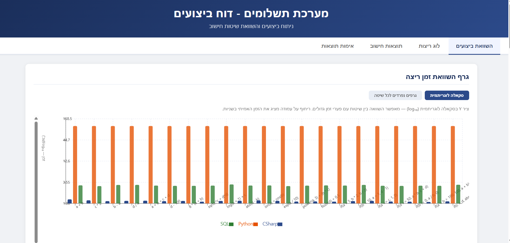

# Dynamic Formula Engine — Performance Benchmark

**מבדק פיתוח רמה ג | משרד החינוך — מנהל טכנולוגיות דיגיטליות ומידע**

> 📄 דוח מסכם מלא: [דוח_מסכם.pdf](./דוח%20מסכם.pdf)
>
> 🔗 **Live Demo:** [dynamic-formula-engine.vercel.app](https://dynamic-formula-engine.vercel.app/)

---

## Overview

מערכת שמחשבת נוסחאות מתמטיות דינמיות על מיליון שורות נתונים בשלוש שיטות מקבילות.
הנוסחאות נטענות מ-DB בזמן ריצה — ללא שינוי קוד — ותוצאות כל שיטה נשמרות ב-`t_results` להשוואה.

**21 נוסחאות** × **1,000,000 שורות** × **3 שיטות** = 63M תוצאות.

---

## Architecture

```
┌─────────────────────────────────────────────────────────┐
│                    SQL Server Express                    │
│  t_data (1M rows)  t_targil (21 formulas)               │
│  t_results (63M)   t_log (timing per formula/method)    │
└────────────┬──────────────────────────────┬─────────────┘
             │                              │
    ┌────────▼────────┐           ┌─────────▼────────┐
    │   C# / .NET 8   │           │  Python 3 Engine │
    │  Roslyn + IL    │           │  Vectorization   │
    │  Parallel.For   │           │  pandas + NumPy  │
    │  SqlBulkCopy    │           │  Parquet/Snappy  │
    └─────────────────┘           └──────────────────┘
             │                              │
    ┌────────▼──────────────────────────────▼────────┐
    │              SQL Stored Procedure               │
    │         sp_executesql + CASE WHEN               │
    └─────────────────────────────────────────────────┘
             │
    ┌────────▼────────────────────────────────────────┐
    │         Node.js / Express  (port 3001)          │
    │         React 18 + Recharts (port 3000)         │
    └─────────────────────────────────────────────────┘
```

---

## Stack

| Layer | Technology |
|---|---|
| DB | SQL Server Express, Windows Authentication |
| C# Engine | .NET 8, Roslyn (`CSharpScript.EvaluateAsync`), `SqlBulkCopy` |
| Python Engine | Python 3, `pandas.eval`, NumPy, PyArrow (Parquet/Snappy), SQLAlchemy |
| SQL Engine | T-SQL, `sp_executesql`, `FAST_FORWARD` cursor |
| Backend | Node.js 18, Express, `mssql/msnodesqlv8` |
| Frontend | React 18, Recharts |

---

## Project Structure

```
├── calculation-engines/
│   ├── CSharp_Project/
│   │   ├── Program.cs                   # FormulaCompiler, BulkDataReader, DataLoader
│   │   └── DynamicFormulaEngine.csproj
│   ├── Python_Project/
│   │   ├── PythonCalculation.py
│   │   └── requirements.txt
│   └── DynamicFormulaEngine.sln
│
├── sql-scripts/
│   ├── 01_schema_and_seed.sql           # DDL + 1M row seed + 21 formulas
│   ├── 02_sql_dynamic_method.sql        # sp_CalculateDynamicFormula + execution block
│   └── 03_compare_methods.sql           # aggregated cross-method verification
│
├── web-dashboard/
│   ├── backend/                         # Express API (port 3001)
│   └── frontend/                        # React app (port 3000)
│
└── screenshots/
```

---

## Database Schema

```sql
t_data     (data_id PK, a FLOAT, b FLOAT, c FLOAT, d FLOAT)          -- 1M rows
t_targil   (targil_id PK, targil, tnai, targil_false)                 -- 21 formulas
t_results  (results_id PK, data_id FK, targil_id FK, method, result)  -- 63M rows
t_log      (log_id PK, targil_id FK, method, run_time FLOAT)          -- timing
```

ערכי `a–d` נזרעים בטווח `[1.1, 101.x)` — offset מונע `log(0)` וחלוקה באפס.

---

## Formulas

| Category | Examples |
|---|---|
| Simple | `a + b`, `c * 2`, `a + b + c + d` |
| Complex | `sqrt(c*c + d*d)`, `log(b + 1) + c`, `sin(a) + cos(b)`, `exp(a / 10)` |
| Conditional | `if(a > 5, b * 2, b / 2)`, `if(b != 0, a / b, 0)`, `if(a + b > 100, 100, a + b)` |

---

## How Each Engine Works

### C# — Roslyn JIT Compilation

1. **Load once** — כל 1M שורות נטענות לזיכרון פעם אחת (`CommandBehavior.SequentialAccess`).
2. **Parallel compile** — כל הנוסחאות מקומפלות במקביל ל-IL נייטיב דרך `CSharpScript.EvaluateAsync`. כל נוסחה הופכת ל-`Func<double,double,double,double,double>`.
3. **Parallel evaluate** — `Parallel.For` מחלק את 1M השורות על כל ליבות ה-CPU. כל thread כותב לאינדקס שלו — ללא locking.
4. **Zero-copy bulk insert** — `BulkDataReader` מממש `IDataReader` ישירות על שני arrays בזיכרון. לא מוקצה `DataTable` (~400MB נחסכים).

**`if()` rewriting** — parser ברמת תו (לא regex) שמטפל נכון ב-nested calls כמו `power(a, 2)`.

**NuGet packages** (`DynamicFormulaEngine.csproj`):
- `Microsoft.CodeAnalysis.CSharp.Scripting` — קומפילציה דינמית של נוסחאות (Roslyn)
- `Microsoft.Data.SqlClient` — חיבור ל-SQL Server

---

### Python — Vectorized + Parquet

1. **Vectorized eval** — `pandas.eval(engine='python')` מריץ כל נוסחה על כל 1M שורות בבת אחת ברמת C. `if()` מוחלף ב-`np.where()` לפני הרצה.
2. **Constant RAM** — כל נוסחה נכתבת לקובץ Parquet נפרד (Snappy) ומשוחררת מיד (`del df, arr`). שימוש ב-RAM קבוע ~80MB ללא תלות במספר הנוסחאות.
3. **Disk savings** — ~8MB לנוסחה ב-Parquet לעומת ~180MB ב-CSV (חיסכון ~95%).
4. **Insert** — `fast_executemany=True` ב-SQLAlchemy. connection אחד משותף לכל הנוסחאות.

**Python packages** (`requirements.txt`):
- `pandas`, `numpy` — חישוב וקטורי
- `sqlalchemy`, `pyodbc` — חיבור ל-SQL Server
- `pyarrow` — כתיבה לקבצי Parquet (**חובה** — בלעדיו הקוד ייכשל)

---

### SQL — Dynamic T-SQL

`sp_CalculateDynamicFormula` בונה ומריץ `INSERT ... SELECT` דינמי לכל נוסחה:

- **Simple formulas** — `targil` מוכנס ישירות כביטוי SQL.
- **Conditional formulas** — `tnai` + `targil_false` ממופים ל-`CASE WHEN ... THEN ... ELSE ... END`. `!=` ו-`==` מנורמלים ל-T-SQL לפני הרצה.
- **Injection prevention** — `@p_targil_id` מועבר כפרמטר ל-`sp_executesql`.
- **Cursor** — `LOCAL FAST_FORWARD READ_ONLY` משמש אך ורק למעבר על רשימת הנוסחאות. החישוב עצמו הוא set-based — `INSERT ... SELECT` אחד על כל 1M שורות בבת אחת.

---

## Prerequisites

- SQL Server Express + Windows Authentication
- ODBC Driver 17 for SQL Server
- .NET 8 SDK
- Python 3.10+ with `pip`
- Node.js 18+

---

## Setup

### 1. Database

הרץ **לפי הסדר** ב-SSMS:

```sql
-- DDL + seed 1M rows + 21 formulas
sql-scripts/01_schema_and_seed.sql

-- Create sp_CalculateDynamicFormula
sql-scripts/02_sql_dynamic_method.sql
```

---

### 2. Calculation Engines

כל מנוע מנקה את תוצאותיו הקודמות לפני ריצה. ניתן להריץ בכל סדר.

**C# — שחזור חבילות NuGet והרצה:**
```bash
cd calculation-engines/CSharp_Project
dotnet restore
dotnet run
```

**Python — התקנת חבילות והרצה:**
```bash
cd calculation-engines/Python_Project
pip install -r requirements.txt
python PythonCalculation.py
```

**SQL — הרצת Stored Procedure:**
```sql
-- כלול בסוף 02_sql_dynamic_method.sql — רץ אוטומטית
-- להרצה חוזרת — הרץ את ה-cursor block ב-02_sql_dynamic_method.sql
```

---

### 3. Verify Results

```sql
sql-scripts/03_compare_methods.sql
```

הסקריפט מבצע השוואה aggregated (AVG/MIN/MAX/STDEV) לכל נוסחה × שיטה ומחזיר verdict:

```
✓ ALL METHODS PRODUCE IDENTICAL RESULTS
```

סף סטייה: `avg_diff > 0.0001` נחשב `RESULT MISMATCH`.

---

### 4. Dashboard

```bash
# Terminal 1
cd web-dashboard/backend
npm install
npm start        # port 3001

# Terminal 2
cd web-dashboard/frontend
npm install
npm start        # port 3000
```

**API endpoints:**

| Endpoint | Description |
|---|---|
| `GET /api/log` | כל רשומות t_log עם שם הנוסחה |
| `GET /api/comparison` | AVG/MIN/MAX זמן ריצה לכל method × formula |
| `GET /api/results` | 2 שורות נתונים × כל הנוסחאות × כל השיטות |
| `GET /api/verify` | cross-method timing comparison מ-t_log |

---

## Performance Characteristics

| Method | Strength | Trade-off | Best For |
|---|---|---|---|
| **C#** | קומפילציה ל-IL נייטיב + `Parallel.For` על כל הליבות | זיכרון גבוה (כל 1M שורות בזיכרון) | Maximum Throughput |
| **Python** | RAM קבוע ~80MB, חיסכון דיסק 95% | insert איטי יותר מ-`SqlBulkCopy` | Memory-Constrained Environments |
| **SQL** | ללא תשתית חיצונית, פשטות תחזוקה | cursor overhead, אין מקביליות | Zero Infrastructure Overhead |

**המלצה:** C# לביצועים מקסימליים. Python לסביבות עם מגבלות זיכרון. SQL כשאין תשתית פיתוח.

---

## Notes

- `NaN` / `Infinity` מוחלפים ב-`0.0` בכל שלוש השיטות ונרשמים ב-log.
- Python יוצר תיקייה זמנית `C:\temp\parquet_batches\` — נמחקת אוטומטית גם במקרה של exception (`finally` block).
- Connection string מניח `.\SQLEXPRESS` עם Windows Authentication — לשינוי ערוך ב-`Program.cs`, `PythonCalculation.py`, ו-`server.js`.

---

## Visuals

צילומי מסך של הדשבורד ותוצאות הבנצ'מרק נמצאים בתיקיית [`/screenshots`](./screenshots/).


